# homework- MySQL_backup

Описание домашнего задания
---
В материалах приложены ссылки на вагрант для репликации и дамп базы bet.dmp

Базу развернуть на мастере и настроить так, чтобы реплицировались таблицы:

| bookmaker   |
| competition |
| market      |
| odds        |
| outcome     |

Настроить GTID репликацию


---
ОС для настройки: CentOS Linux release 7.9.2009 (Core)

Vagrant версии 2.4.1

VirtualBox версии 7.0.18

---
- Этап 1: Создаем Vagrantfine, запускаем ВМ.

После того, как VM развернулись, получаем 2 хоста:

**sqlserver** - будет нашим мастером


**sqlreplica** - будет нашим slave сервером 

**для удобства** обновляем пакеты, устанавливаем: yum install -y nano 


---
- Этап 2: Установка percona-server-57. **Работаем на Master**

**Команда из методички** не работает, так что идем немного иначе 


```bash
# Недоступная ссылка уже
yum install http://www.percona.com/downloads/percona-release/redhat/0.1-6/percona-release-0.1-6.noarch.rpm -y
```

```bash
# Вот так работает
yum install https://repo.percona.com/yum/percona-release-latest.noarch.rpm
percona-release setup ps57
yum install Percona-Server-server-57
```


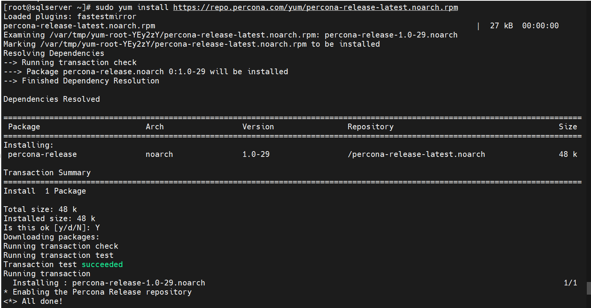
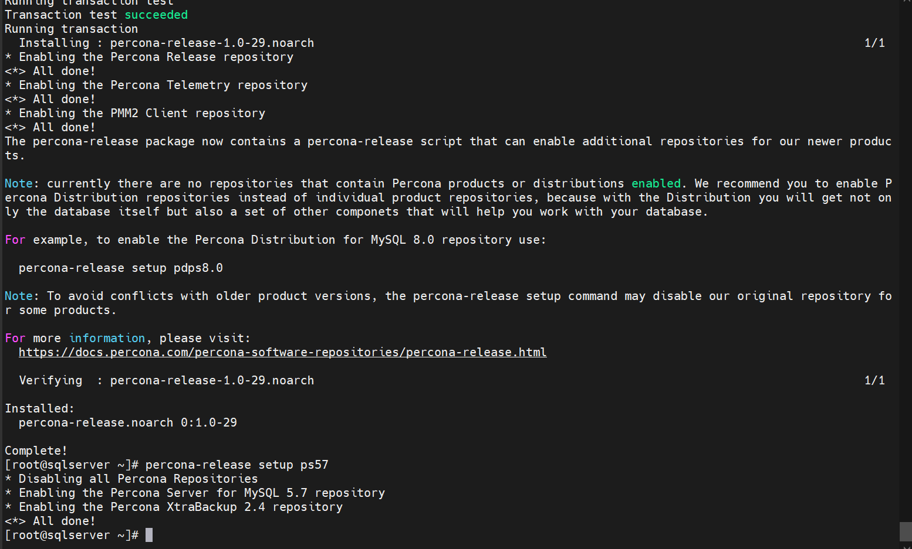
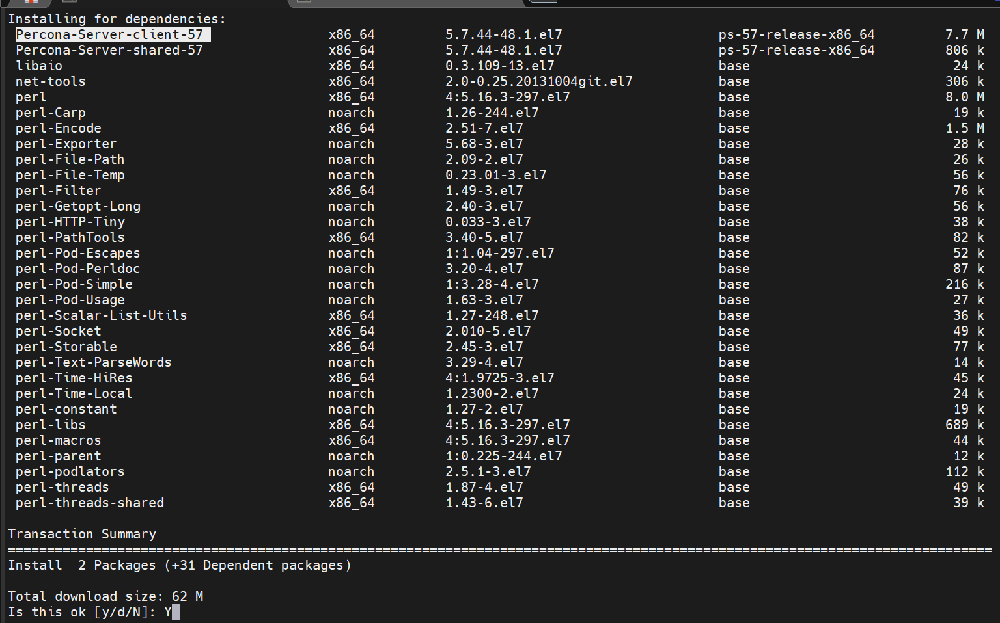
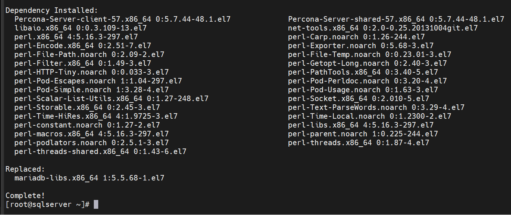


**По умолчаниĀ Percona хранит файлý в таком виде:**

● Основной конфиг в /etc/my.cnf

● Так же инклудится директория /etc/my.cnf.d/ - куда куда мы и будем складывать наши конфиги.

● Дата файлы в /var/lib/mysql


---
**Копируем конфиги в /etc/my.cnf.d/**

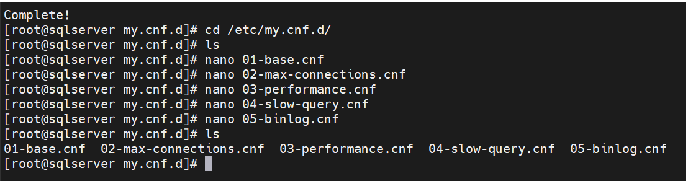


**Запускаем службу**

```bash
systemctl start mysql
```

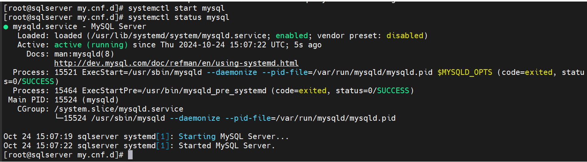


*При установке Percona автоматически генерирует паролþ длā полþзователā root и кладет его в
файл /var/log/mysqld.log*


**Смотрим пароль**

```bash
cat /var/log/mysqld.log | grep 'root@localhost:' | awk '{print $11}'
```


**Подключаемся к mysql**


```bash
mysql -uroot -p'<PASS_из_предыдущей_команды>'
```

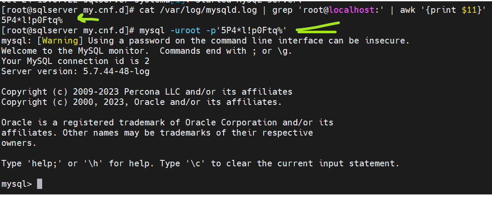


**После подклчения меняем пароль** Кстати, тут есть требования к сложности пароля


```bash
ALTER USER USER() IDENTIFIED BY '<YourStrongPassword>';
```

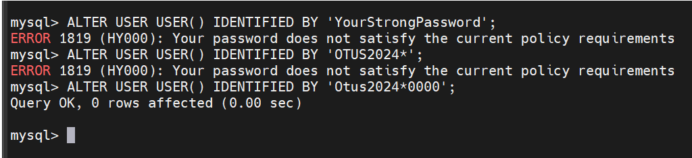


---
**Следует обратить внимание**, что атрибут server-id на мастер-сервере должен обязательно отличаться от server-id слейв-сервера. Проверить какая переменная установлена в текущий момент можно следующим образом:

```bash
mysql> SELECT @@server_id;
```


**Убеждаемся, что GTID Включен**

```bash
mysql> SHOW VARIABLES LIKE 'gtid_mode';
```


---
**Создаем тестовую базу данных bet и загружаем в нее дамп**

```bash
CREATE DATABASE bet;
```

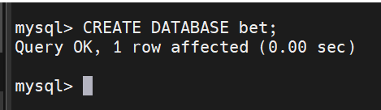


```bash
mysql -uroot -p -D bet < /vagrant/bet.dmp
```


**Вот тут я долго тупил, так как не заметил, где выполняю команду** Подгрузка дампа идет с основной машины, только потом проваливаемся в нее и смотрим 


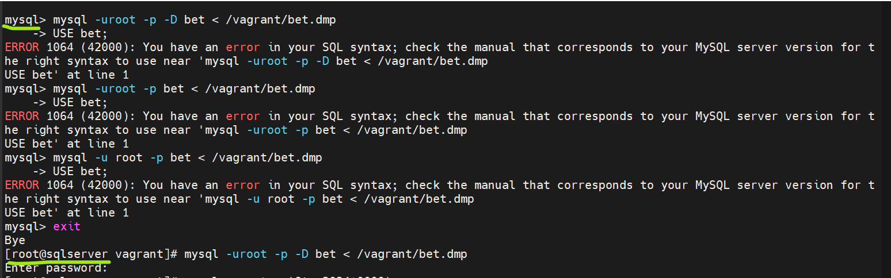


```bash
mysql> USE bet;
mysql> SHOW TABLES;
```

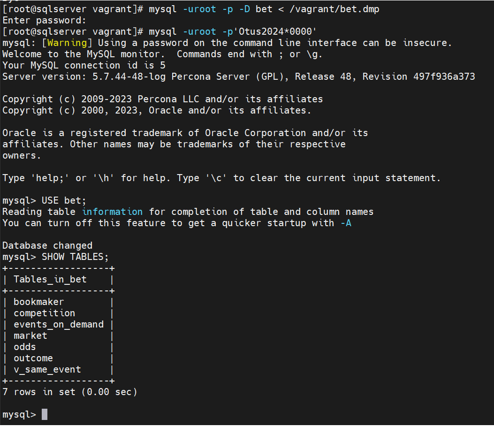


---
**Создаем пользователя для репликации и даем ему права на выполнение репликации**

```bash
mysql> CREATE USER 'repl'@'%' IDENTIFIED BY '!OtusLinux2024';
mysql> SELECT user,host FROM mysql.user where user='repl';
# даем права
mysql> GRANT REPLICATION SLAVE ON *.* TO 'repl'@'%' IDENTIFIED BY '!OtusLinux2024';
```


---
**Делаем дамп базы для дальнейшего импорта на slave и игнорируем таблицы, по заданию** (команда в одну строку)

```bash
mysql> mysqldump --all-databases --triggers --routines --master-data --ignore-table=bet.events_on_demand --ignore-table=bet.v_same_event -uroot -p > master.sql
```


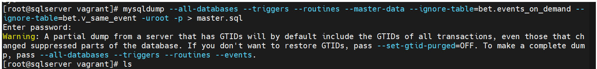


---
- Этап 3: Настройка Slave


**Созданный дамп нужно закинуть с Мастера на Слэйф**

Я использовал scp

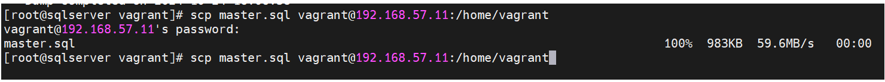


---
На Slave сервере так же создаем\перекидываем конфиги в каталог /etc/my.cnf.d/


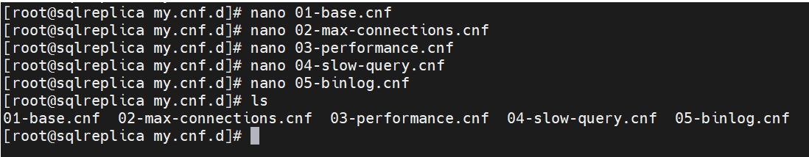


---
**В конфиге /etc/my.cnf.d/01-base.cnf поправим директиву server-id = 2**, так как они должны отличаться с мастером


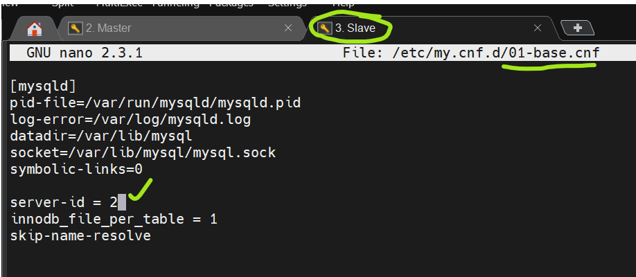


---
**Аналогично как на Мастере, устанавливаем сервер, меняем пароль** На заметку, пока не стартануть, пароль не создается 


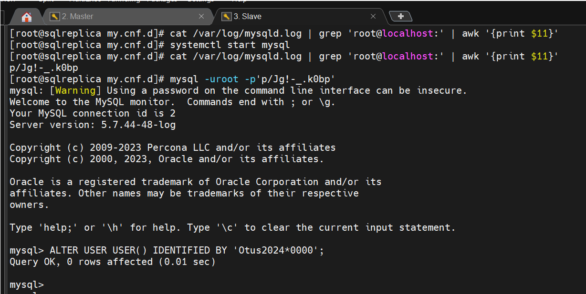


---
**Проверяем директиву server-id = 2**


```bash
mysql> SELECT @@server_id;
```


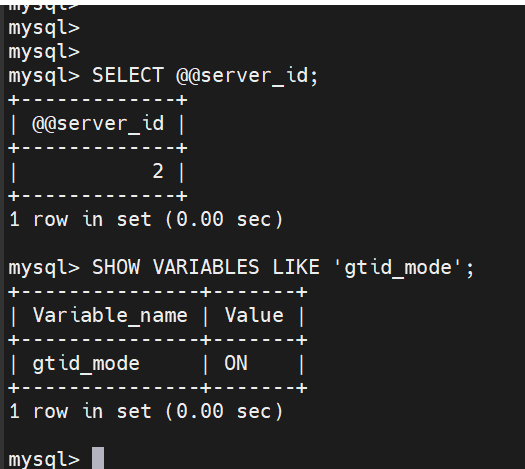


---
**Раскомментируем в /etc/my.cnf.d/05-binlog.cnf строки** Это нужно, чтобы указать таблицы, которые будут игнорироваться при репликации данных

```bash
#replicate-ignore-table=bet.events_on_demand
#replicate-ignore-table=bet.v_same_event
```

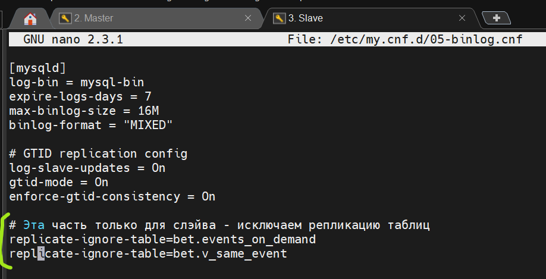


---
- Этап 4: Импорт дампа

**Заливаем дамп**

**Примечание**. Если ошибиться с директорией, получаем ошибку 


```bash
mysql> SOURCE /mnt/master.sql
```


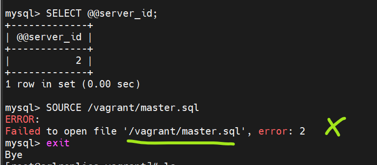

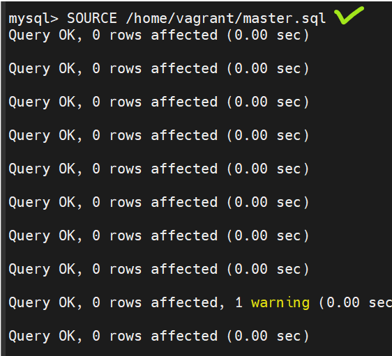

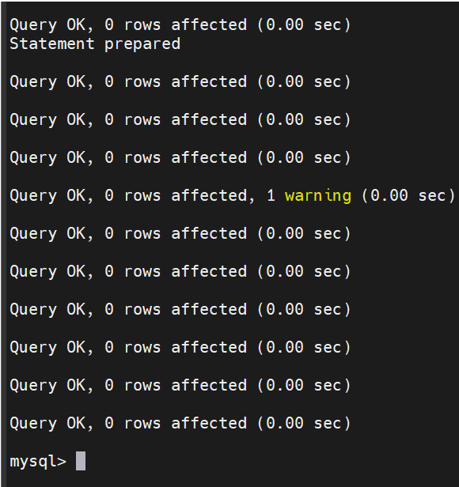


---
**Проверяем залитую базу** 


```bash
mysql> SHOW DATABASES LIKE 'bet';
mysql> USE bet;
mysql> SHOW TABLES;

# видим что таблиц v_same_event и events_on_demand нет
```


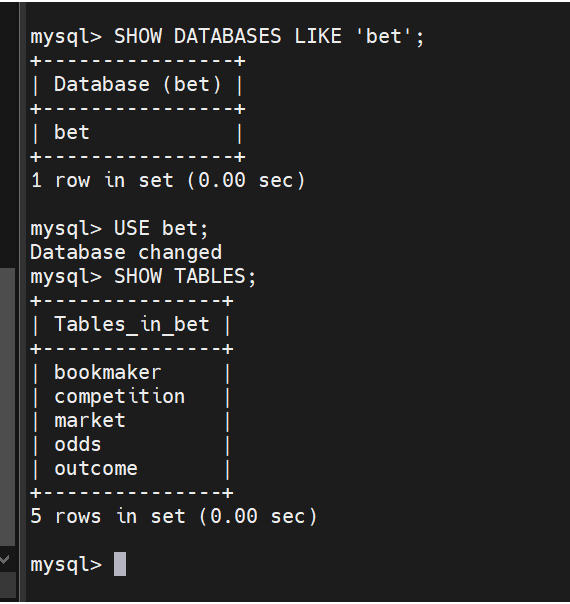


---
**Подключаемся и запускаем слэйв** 


```bash
CHANGE MASTER TO MASTER_HOST = "192.168.57.10", MASTER_PORT = 3306, MASTER_USER = "repl", MASTER_PASSWORD = "!OtusLinux2024", MASTER_AUTO_POSITION = 1;
# не забываем сменить пароль и IP адрес, если надо
```


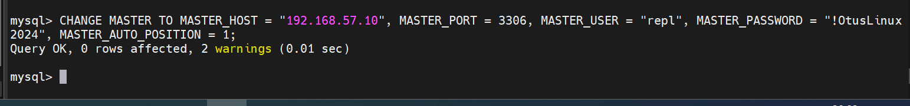


```bash
mysql> START SLAVE;
mysql> SHOW SLAVE STATUS\G
```


---
**А теперь залипаем на часа полтора, потому что ловим ошибку** (увы, форумы гугла от 2005 года не особо помогли в решении(((( )

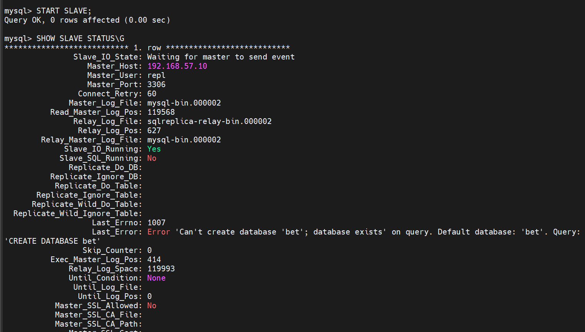
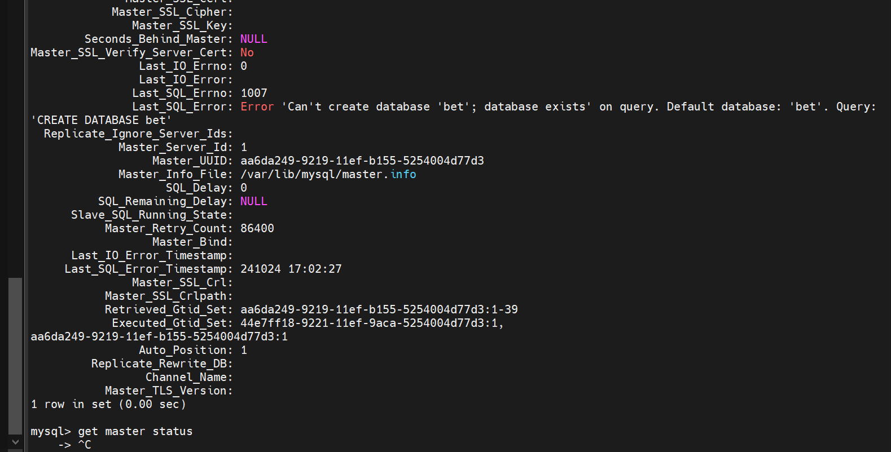


---
**Смотрим, что было сделано до этого, где что упустил**

**Нашел при заливке дампа вот такое. Наверно, это что-то нехорошее :DDD**

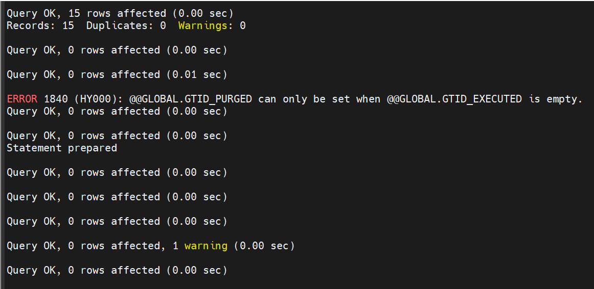


**Гугл опять не особо помогает, либо я не там ищу где-то**


```bash
Пробовал пересоздать таблицу
удалить
залить дамп без таблицы

Не помогло ничего
```


**Возникла мысль**, что, может при передачи файла с мастера на слейф - он побился?! Не, ну мало ли, виртуалки же, ресурсов не очень много. Пошел проверять элементарно размеры файла на мастере и на слэйве


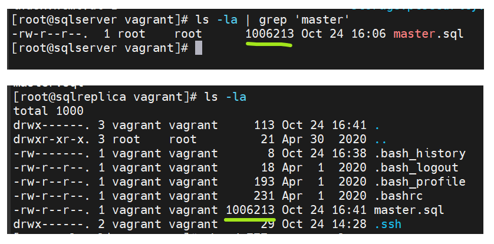


**Одинаково……** НО, почему-то мой взгляд зацепился, что пользователь файла vagrant….а я же запускаюсь как root….

**Расширяем права на файл**


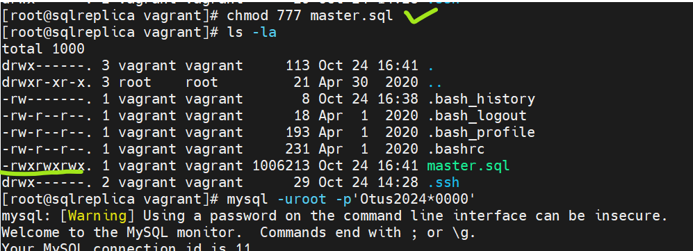


```bash
После этого
Подключаюсь к базе на слэйве
Удаляю старую таблицу bet (на всякий случай)
Создаю заново эту таблицу
Заливаю дамп повторно

Ошибку не увидел! Ура)) 
```


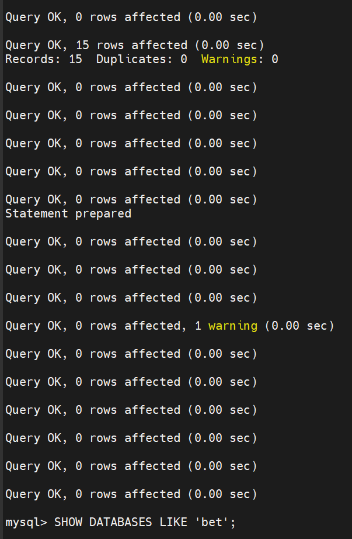


---
**Делаем проверку**


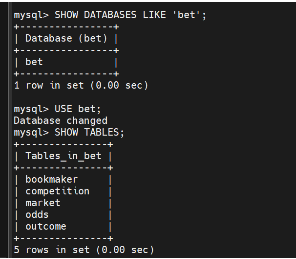


---
**Второй раз** кстати подключаться к мастеру не надо


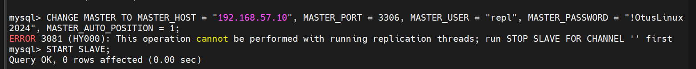


**Просто стартуем и проверяем**


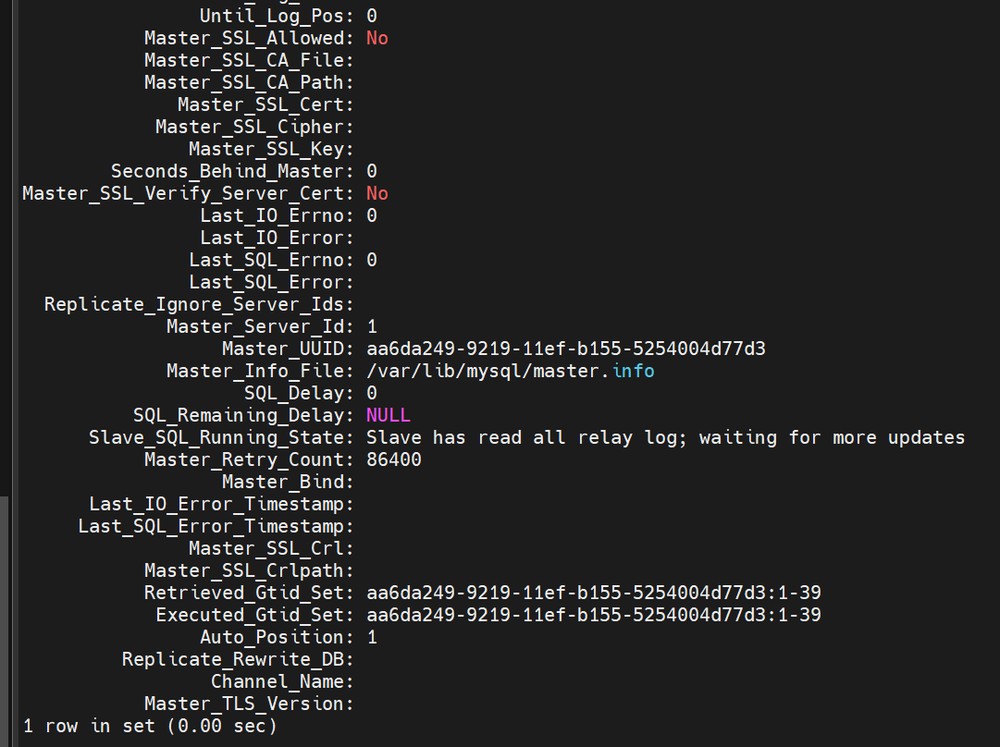


**Наконец-то, репликациā работает, gtid работает и игнорируются нужные таблички**


---
- Этап 5: Проверяем работу репликации

**На мастере** вносим изменения в таблицу

```bash
mysql> USE bet;
mysql> INSERT INTO bookmaker (id,bookmaker_name) VALUES(1,'1xbet');
mysql> SELECT * FROM bookmaker; 
```

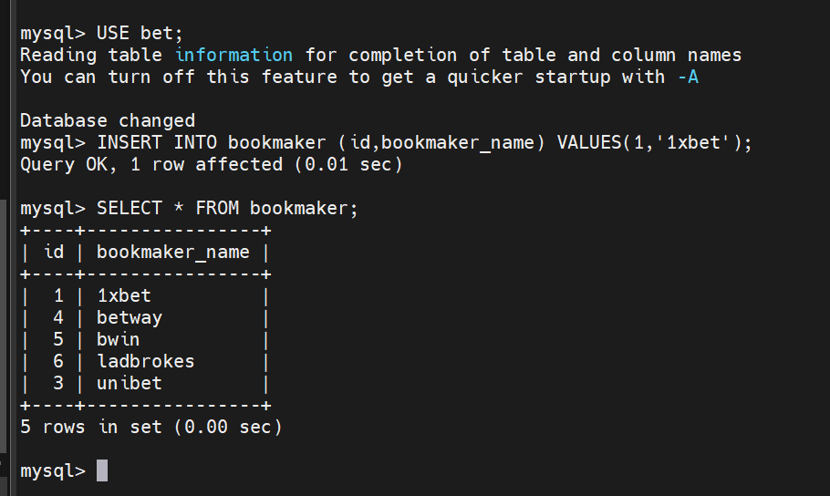


**На слэйве** просто проверяем

```bash
mysql> SELECT * FROM bookmaker;
```

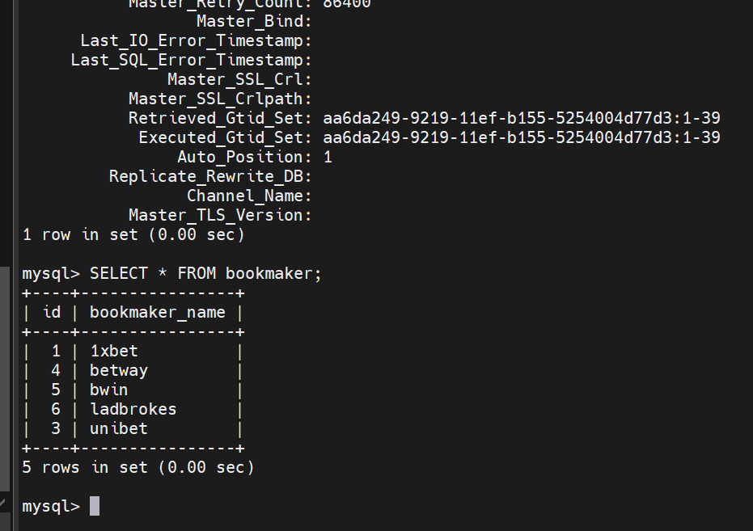


**Видим, что на слэйве появились изменения!**. Если что, 1xbet - это не реклама ставок :D


